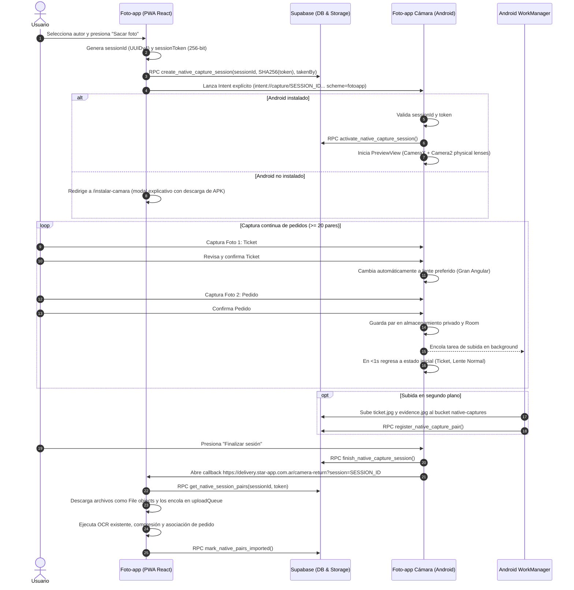

# Arquitectura de la Aplicación Android Auxiliar (Foto-app Cámara Nativa)

Este documento detalla la arquitectura, el modelo de seguridad, la comunicación bidireccional PWA ↔ Android, la gestión de hardware de cámara (especialmente gran angular en dispositivos POCO y Motorola), el almacenamiento local con Room y WorkManager, y los procedimientos de prueba y rollback.

---

## 1. Visión General del Sistema

Foto-app se mantiene como una PWA React (versión 1.5 en producción) que gestiona:
- Autenticación e identidad del autor.
- Métricas, reclamos e historial de pedidos.
- Cola de procesamiento y OCR (Tesseract / Cloud OCR).
- Compresión final y almacenamiento en Supabase.

La aplicación Android complementaria (`android-camera/`) es una herramienta especializada exclusivamente en la captura fotográfica continua:
- Cámara nativa con **CameraX** y **CameraCharacteristics (Camera2)**.
- Acceso a lentes físicos reales (gran angular / ultra-wide) sin recorte digital.
- Operación ininterrumpida de al menos 20 pares continuos por sesión (Ticket → Pedido).
- Almacenamiento local persistente con **Room**.
- Subidas asíncronas en segundo plano con **WorkManager** sin degradar los fotogramas de la cámara.
- Tolerancia total a pérdida de conexión y cierre inesperado de la aplicación.
- Retorno controlado a Foto-app una vez finalizada la sesión.

---

## 2. Diagrama de Flujo (PWA ↔ Android ↔ Supabase)



---

## 3. Protocolo de Comunicación PWA ↔ Android

### 3.1 Apertura mediante Intent
La PWA abre la aplicación Android mediante un intent URI con fallback al instalador web:

```text
intent://capture/{SESSION_ID}#Intent;
scheme=fotoapp;
package=ar.com.starapp.fotoappcamera;
S.sessionToken={TOKEN_256_BITS};
S.browser_fallback_url=https%3A%2F%2Fdelivery.star-app.com.ar%2Finstalar-camara;
end
```

### 3.2 Esquemas y Android App Links Verificados
Configurados en `AndroidManifest.xml`:
- **Esquema personalizado:** `fotoapp://capture/{SESSION_ID}?token={TOKEN}`
- **Android App Links (Universal Links):** `https://delivery.star-app.com.ar/capture/{SESSION_ID}?token={TOKEN}`
- **Digital Asset Links:** Servido en `/.well-known/assetlinks.json` con el `package_name` y el certificado SHA-256 de firma.

### 3.3 Callback Seguro de Regreso a la PWA
La aplicación Android regresa únicamente a la URL oficial registrada:
```text
https://delivery.star-app.com.ar/camera-return?session={SESSION_ID}
```
*Regla de seguridad:* La aplicación Android rechaza cualquier URL cuyo host sea diferente a `delivery.star-app.com.ar` o cuya ruta no sea `/camera-return`. Nunca se transmite el `sessionToken` en la URL de regreso.

---

## 4. Detección y Manejo de Lentes Físicos (POCO X6 Pro y Moto G15)

En dispositivos como el **POCO X6 Pro** (Xiaomi HyperOS / MediaTek Dimensity 8300-Ultra) y el **Moto G15** (Motorola / Android Go / T616), Chrome solo expone cámaras virtuales genéricas con zoom desde 1× hasta 4×. 

La aplicación nativa implementa un algoritmo de inspección profunda en `CameraDetector.kt`:

1. **Rango de zoom sub-1× (`CONTROL_ZOOM_RATIO_RANGE`):**
   - En Android 11+ (API 30+), dispositivos como Xiaomi exponen el lente ultra-wide a través de la cámara trasera lógica (`CameraCharacteristics.LENS_FACING_BACK`) aceptando valores de zoom como `0.55×` o `0.6×`.
   - Si `minZoomRatio < 0.99f`, se habilita el botón de gran angular mapeando el zoom al límite inferior del hardware.

2. **Cámaras físicas expuestas (`physicalCameraIds`):**
   - Si la cámara lógica trasera publica IDs físicos (`chars.physicalCameraIds`), se examinan los `CameraCharacteristics` de cada lente secundario:
     - Distancia focal (`LENS_INFO_AVAILABLE_FOCAL_LENGTHS`).
     - Dimensiones físicas del sensor (`SENSOR_INFO_PHYSICAL_SIZE`).
     - Cálculo de campo de visión horizontal (HFOV):
       $$\text{HFOV} = 2 \times \arctan\left(\frac{\text{sensorWidthMm}}{2 \times \text{focalLengthMm}}\right) \times \frac{180}{\pi}$$
     - Si $\text{HFOV} \ge 80^\circ$, se clasifica como Gran Angular / Ultra-wide.
     - Si $\text{HFOV} \ge 100^\circ$, se rotula como **0,5×**. Si está entre $80^\circ$ y $100^\circ$, se rotula como **Amplio**.

3. **Fallback si el fabricante oculta los lentes:**
   - Si el fabricante restringe el acceso al sensor físico para aplicaciones de terceros, la aplicación muestra: *"Gran angular no disponible para aplicaciones externas"*.
   - **No se aplica recorte digital simulado.**
   - Todos los parámetros detectados se guardan en el panel de **Diagnóstico técnico**.

---

## 5. Máquina de Estados de Captura

| Estado | Descripción | Transición Siguiente |
| :--- | :--- | :--- |
| `READY_FOR_TICKET` | Cámara activa en lente Normal (1×). Guía de encuadre para ticket. | Al presionar disparador → `CAPTURING_TICKET` |
| `CAPTURING_TICKET` | Disparo en curso sin bloquear el hilo principal. | Al completar captura → `REVIEW_TICKET` |
| `REVIEW_TICKET` | Vista previa de la foto del ticket. Botones: "Usar foto" o "Repetir". | Si "Repetir" → `READY_FOR_TICKET`. Si "Usar foto" → `READY_FOR_EVIDENCE` |
| `READY_FOR_EVIDENCE` | Conmuta automáticamente al lente preferido de pedido (Gran Angular si está disponible). | Al presionar disparador → `CAPTURING_EVIDENCE` |
| `CAPTURING_EVIDENCE` | Disparo de evidencia. | Al completar captura → `REVIEW_EVIDENCE` |
| `REVIEW_EVIDENCE` | Vista previa del pedido. Botones: "Usar foto", "Repetir", o "Volver al ticket". | Si "Repetir" → `READY_FOR_EVIDENCE`. Si "Volver al ticket" → `REVIEW_TICKET`. Si "Usar foto" → `SAVING_PAIR` |
| `SAVING_PAIR` | Guarda el par en Room, encola en WorkManager, e inmediatamente (<1s) regresa a `READY_FOR_TICKET`. | `READY_FOR_TICKET` |

---

## 6. Cola Local Persistente y Resiliencia Offline

- **Directorio privado:** Las fotos se almacenan en `context.filesDir/sessions/{sessionId}/`. Nunca en la galería pública sin autorización.
- **Entidades Room:**
  - `NativeCaptureSession`: Controla el estado de la sesión (`created`, `active`, `finishing`, `completed`).
  - `NativeCapturePair`: Registra `pairNumber` (secuencia estricta y única), rutas locales, hashes SHA-256, y estado de subida (`local`, `preparing`, `uploading`, `uploaded`, `imported`).
- **WorkManager:**
  - Ejecuta la subida con reintentos exponenciales automáticos (`BackoffPolicy.EXPONENTIAL`).
  - Si no hay conexión, los pares se conservan intactos en el dispositivo.
  - Al recuperar conectividad, el `ConnectivityManager.NetworkCallback` despierta el `UploadScheduler`.
  - Si el usuario presiona "Finalizar sesión" sin internet, la aplicación permite volver a Foto-app informando cuántos pares siguen en cola local. Las subidas se completarán en background tan pronto como regrese la red.

---

## 7. Protocolo de Pruebas Físicas (POCO X6 Pro y Moto G15)

Checklist de validación en campo:

- [ ] **1. Lanzamiento desde PWA:** Abrir Foto-app en Chrome/PWA, seleccionar autor, presionar "Sacar foto". Comprobar que Android abre directamente la cámara nativa sin pantallas intermedias.
- [ ] **2. Sesión continua de 20 pedidos:** Capturar 20 pares ticket + pedido consecutivamente sin salir de la cámara ni experimentar reinicios de preview.
- [ ] **3. Gran angular real:** Alternar entre 1× y 0,5× (o Amplio). Verificar visualmente que el campo visual se expande físicamente sin degradación por zoom digital.
- [ ] **4. Gestos:** Probar pellizco para zoom (pinch-to-zoom) y toque para enfocar (tap-to-focus con recuadro rojo visual).
- [ ] **5. Flash y linterna:** Comprobar disparo con flash en ambientes oscuros.
- [ ] **6. Corrección de errores en captura:** Repetir un ticket descartando la foto previa. Repetir un pedido conservando el ticket tomado.
- [ ] **7. Prueba offline:** Activar "Modo Avión", tomar 3 pares, comprobar que los contadores indican "Sin conexión" y guardan localmente. Desactivar "Modo Avión" y verificar que WorkManager sincroniza automáticamente.
- [ ] **8. Cierre forzado:** Cerrar la aplicación desde la multitarea de Android mientras hay pares pendientes. Reabrir y verificar que la cola y las fotos siguen intactas.
- [ ] **9. Ticket incompleto:** Tomar foto de ticket y presionar "Finalizar". Verificar que el modal ofrece "Completar pedido" o "Descartar ticket incompleto".
- [ ] **10. Retorno a Foto-app:** Tocar "Finalizar". Verificar regreso a `https://delivery.star-app.com.ar/camera-return?session=SESSION_ID`, importación secuencial de fotos, ejecución de OCR y persistencia final en Supabase sin duplicados.

---

## 8. Guía de Instalación ADB para Desarrolladores y Testers

1. **Habilitar Depuración USB en el teléfono:**
   - Ir a *Ajustes* → *Acerca del teléfono*.
   - Tocar 7 veces en *Número de compilación* (o *Versión de HyperOS/MIUI*).
   - Ir a *Ajustes adicionales* → *Opciones de desarrollador* → Activar *Depuración USB* e *Instalar vía USB*.

2. **Compilar e instalar el APK debug:**
   ```bash
   cd android-camera
   ./gradlew assembleDebug
   adb install -r app/build/outputs/apk/debug/app-debug.apk
   ```

3. **Verificar Android App Links:**
   ```bash
   adb shell am start -a android.intent.action.VIEW -d "fotoapp://capture/test-session-uuid?token=test-token"
   ```

4. **Monitorear logs técnicos:**
   ```bash
   adb logcat -s FotoAppCamera:V UploadWorker:V CameraXManager:V
   ```

---

## 9. Feature Flag y Procedimiento de Rollback

### Feature Flag Web
La integración nativa en Foto-app está protegida por la variable de entorno:
```env
VITE_NATIVE_CAMERA_ENABLED=true
```
- **Si está desactivada (`false` o ausente):** Foto-app opera con el flujo clásico de cámara web React 1.5, garantizando cero impacto en la operación actual.
- **Si está activada (`true`):** Ofrece el disparador nativo, manteniendo el botón clásico como alternativa visible.

### Procedimiento de Rollback
En caso de detectar alguna incompatibilidad no recuperable en un modelo de teléfono específico:
1. Cambiar `VITE_NATIVE_CAMERA_ENABLED=false` en el entorno o build de la PWA.
2. La cámara web tradicional retoma el 100% de las capturas de inmediato sin necesidad de reinstalar nada en los teléfonos.
3. Los pares que hubieran quedado pendientes de sincronizar en la app Android conservan sus archivos en Room y pueden extraerse por ADB o sincronizarse cuando se resuelva el incidente.
